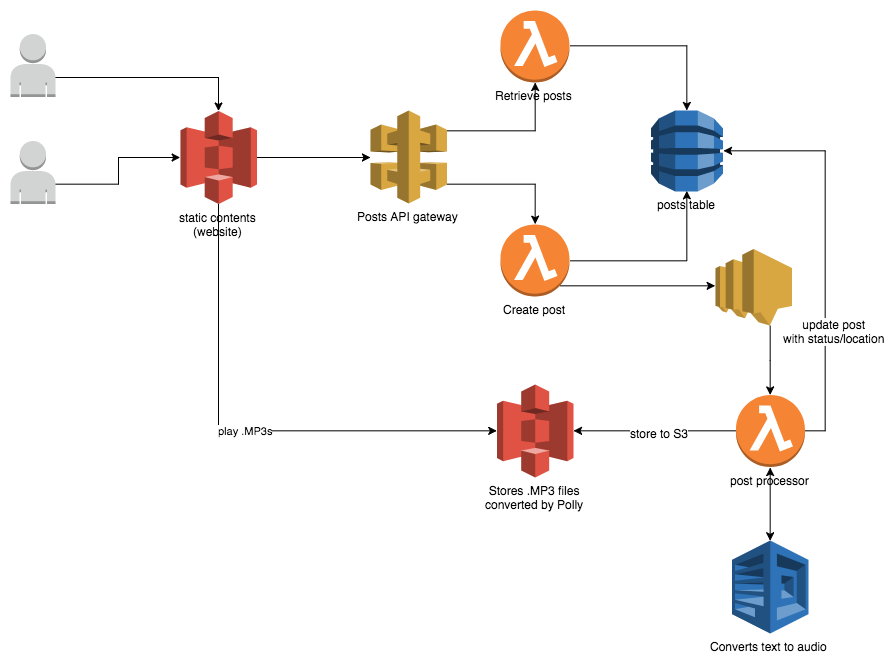

> As part of the **AWS Labs** series, this blog post describes a simple, easy to implement and cost-effective service that allows users to submit text and listen back to a converted sound file (.mp3)

[Polly](https://aws.amazon.com/polly/) is a [recently introduced](https://aws.amazon.com/about-aws/whats-new/2016/11/introducing-amazon-polly/) managed AWS service that performs text-to-speech. While new, it already supports dozens of voices (over 50!) and, like other AWS services, the interaction is managed through language-specific bindings/client (the famous [AWS SDK](https://aws.amazon.com/getting-started/tools-sdks))

> See this in action [demo](http://labs.alexdobjanschi.me/text-to-audio/)
(<small>Drop me a PM for API access key</small>)

> Grab the source code [here](https://github.com/djalexd/aws-labs-text-to-audio)

### Getting started

As already mentioned, this post is proof of concept for [Polly](https://aws.amazon.com/polly/), "wrapped" with a couple of other components that make the whole flow simpler:
* basic UI to interact with
* posts persistence using DynamoDB
* API that _creates a post_ (POST) and _lists all posts_ (GET)
* backend processor that gets notified via [SNS](https://aws.amazon.com/sns)

The solution diagram is the following:



### Implementation details

There are a couple of things happening in this diagram:
1. Users visit the site address, which in turn load static contents from an S3 bucket. The bucket is configured to [host a static website](https://docs.aws.amazon.com/AmazonS3/latest/dev/WebsiteHosting.html)
2. The Javascript client communicates with an API gateway (to retrieve all available posts or to publish a new one)
3. API gateway has a single endpoint `/text-to-audio` with 2 methods: `GET` (retrieve posts) and `POST` (submit a new post). Both methods are configured to invoke lambda functions that interact with a single DynamoDB table.


> Since process (text-to-speech conversion) can take more than than API gateway timeout (_29 seconds_), it' advisable  to decouple frontend-related functionality from long-running tasks. Particularly here, create new posts & converting text-to-speech

4. All these messages are sent via SNS topic to an offline processor (lambda function). This is the moment when [Polly](https://aws.amazon.com/polly/) is called. The function actually performs slightly more than it should: convert, stream result body to S3 and update item in database. But alas, this is a demo! (<small>_hint: use step functions_</small>)

### Final thoughts

This was a super fun lab where besides text-to-speech via Polly, I got to practice with ReactJS (barebones, no Redux). All the AWS resources are managed with Terraform code, so I don't really have _to ever manually go into AWS account and configure anything_!

But, because this is merely a lab/demo, I simplified a couple of aspects:
<small>
* by far this is not a production environment: static website contents, as well as generated .mp3 files are _publicly accessible_ without any authentication or credentials!
* API gateway security is achieved using _api key_ and while it's easy to add more keys (e.g. one key per consumer), it also doesn't scale beyond a handful of items. This is by far the easiest method to secure API access.
* _No unit tests or integration tests!_
* No CI/CD pipelines.
* Everything is provisioned through _Terraform_, but some resources' lifecycle should be decoupled (e.g. UI static resources should not be deployed every time - unwanted side-effect because a [*null_resource*](https://www.terraform.io/docs/provisioners/null_resource.html) is used)

</small>

### Gotchas

* I particularly struggled with API Gateway CORS configuration, so be extra careful there! Perhaps a different integration method could be possible, but `AWS_PROXY` simply returns whatever is configured with lambda response. UI finally worked when I added `Access-Control-Allow-Origin` header in lambda response, as seen [here](https://github.com/djalexd/aws-labs-text-to-audio/blob/master/functions/http.py#L8)
```python
  return {
      'statusCode': 200,
      'body': payload,
      'headers': {
        'Access-Control-Allow-Origin': '*'
      }
  }
```
* Getting IAM roles is time consuming, but rewarding on the long-run (e.g. API gateway lambda invocation, lambda execution). _Make sure your roles allow enough permissions for necessary functionality, but nothing more!_
* _Always write unit tests!_ If for no better reason (code coverage, code complexity, static code analysis, BDD, etc etc etc), it simply felt that uploading & manually testing functionality is too slow. I estimated to have lost about 3 hours of debugging (compile, zip, upload, test ... repeat) on simple things like undefined variables, wrong number of parameters, etc. Linting would also help a lot!

I hope you enjoyed this lab! See you next time!